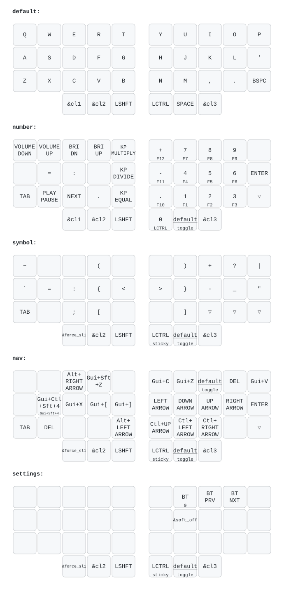
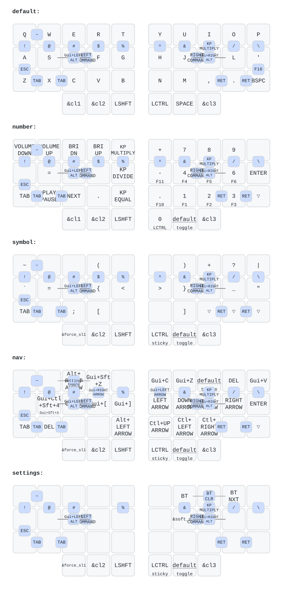

## Layers (no combos)

## Layers with combos

## Go60

`config/go60.keymap` is a Go60 port of the Chocofi layout. It keeps the
QWERTY, NUM, SYM, NAV, and SET layers, the six thumb-key layer controls, Mac
modifiers, and the Chocofi combos translated to Go60 key positions. Space is
on the right thumb under the N-side column, while NAV stays on the far-right
thumb.

The physical MoErgo key is preserved: tap it to show status indicators, or
hold it for the Go60 Magic layer with RGB, Bluetooth, USB, media, and reset
controls. The integrated right touchpad remains mouse input; the left
touchpad scrolls and its click acts as right-click.

The Go60 workflow builds the left and right halves into one `go60.uf2`
artifact using the official MoErgo ZMK distribution. Push the repository and
download that artifact from the **Build Go60 firmware** GitHub Actions run.
